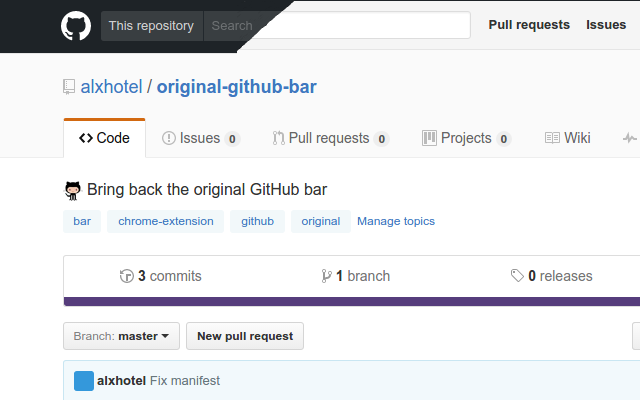

# Original GitHub Bar
:octocat: Bring back the original GitHub bar

A Chrome Extension that brings you the original GitHub bar. Because sometimes the old-fashioned way is better.

## Stylish support

If you already use the [Stylish chrome extension](https://chrome.google.com/webstore/detail/stylish-custom-themes-for/fjnbnpbmkenffdnngjfgmeleoegfcffe), you can just copy the file `extension/main.css` and paste it in your Stylish editor.
